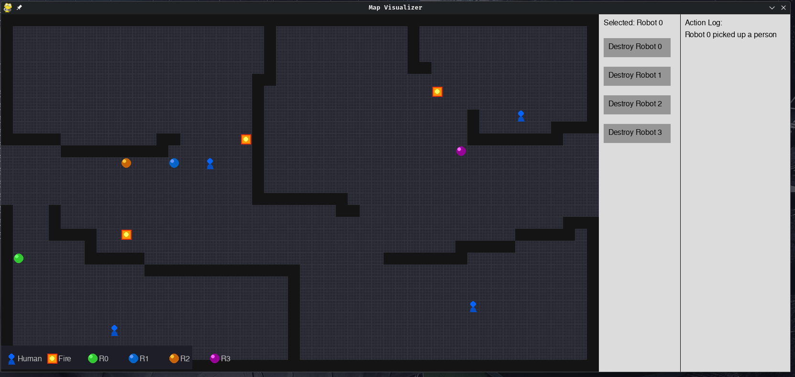

# MultiRobotUGP

A ROS 2-based multi-robot simulation for aerial ground penetration tasks. The simulation features multiple robots navigating a map, rescue humans, and extinguish fires.



## Features

- **Map Publisher**: Reads occupancy grid from CSV and publishes to `/map` topic
- **Entity Simulation**: Randomly places humans and fires on free cells
- **Map Visualizer**: Real-time pygame visualization showing:
  - Walls/Obstacles (black)
  - Free cells (white)
  - Humans (blue circles)
  - Fires (red rectangles)
  - Robots (green rectangles)

## Prerequisites

- ROS 2 (Humble or later)
- Python 3.8+
- pygame
- colcon

## Installation

```bash
cd /home/shivang/Documents/Aerial/MultiRobotUGP
colcon build --packages-select sim
```

or alternatively install pixi with 

``` bash
curl -fsSL https://pixi.sh/install.sh | sh # If pixi is not installed
pixi run build
pixi run sim
```

## Running the Simulation

### Method 1: Using the launch file (recommended)

```bash
source install/setup.bash
ros2 launch sim simulation_launch.py
```

### Method 2: Running nodes individually

```bash
source install/setup.bash
ros2 run sim map_publisher &
ros2 run sim entity_sim &
ros2 run sim map_visualizer
```

### Running the controller

#### Naive Solver
``` bash
ros2 run solver
# or if used pixi
pixi run solver
```


#### Resilient Solver
``` bash
ros2 run resilient_solver
# or if used pixi
pixi run resilient_solver
```

## Map Format

The map is defined in `src/sim/map.csv` as a 2D binary grid:
- `0` = free cell
- `1` = occupied/wall

Example (15x15):
```
1,1,1,1,1,1,1,1,1,1,1,1,1,1,1
1,0,0,0,1,0,0,0,1,0,0,0,1,0,1
1,0,0,0,1,0,0,0,1,0,0,0,1,0,1
...
```

## Robot Control

Robots can be controlled via ROS 2 topics and services:

- **Movement**: Publish to `/robot{id}/move` (`std_msgs/String`: "N", "S", "E", "W")
- **Pick Human**: Call service `/robot{id}/pick` (`std_srvs/Trigger`)
- **Extinguish Fire**: Call service `/robot{id}/remove_fire` (`std_srvs/Trigger`)
- **Drop Human**: Call service `/robot{id}/drop` (`std_srvs/Trigger`)

## Topic Summary

| Topic/Service | Type | Description |
|---------------|------|-------------|
| `/map` | `nav_msgs/OccupancyGrid` | The environment map |
| `/entities` | `visualization_msgs/MarkerArray` | Humans, fires, robots visualization |
| `/robot{id}/move` | `std_msgs/String` | Move command (N/S/E/W) |
| `/robot{id}/pick` | `std_srvs/Trigger` | Pick human service |
| `/robot{id}/remove_fire` | `std_srvs/Trigger` | Extinguish fire service |
| `/robot{id}/drop` | `std_srvs/Trigger` | Drop human service |

## License

MIT
